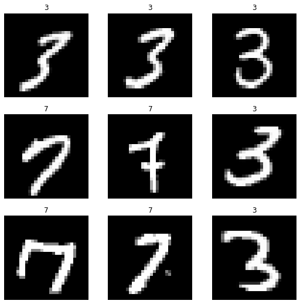
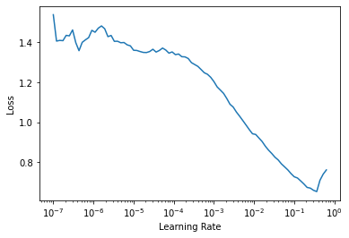
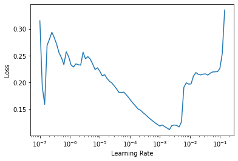

# FastAI XLA Extensions Library
> The FastAI XLA Extensions library package allows your fastai/Pytorch models to run on TPUs using the Pytorch-XLA library.


## Install

`pip install git+https://github.com/butchland/fastai_xla_extensions`

## How to use

### Configure the Pytorch XLA package 

The Pytorch xla package requires an environment supporting TPUs (Kaggle kernels, GCP or Colab environments required)

If running on Colab, make sure the Runtime Type is set to TPU.


```
#hide_input
#colab
import os
assert os.environ['COLAB_TPU_ADDR'], 'Make sure to select TPU from Edit > Notebook settings > Hardware accelerator'
```

```
#hide_output
#colab
VERSION = "20200325"  #@param ["1.5" , "20200325", "nightly"]
!curl https://raw.githubusercontent.com/pytorch/xla/master/contrib/scripts/env-setup.py -o pytorch-xla-env-setup.py
!python pytorch-xla-env-setup.py --version $VERSION
```

    Updating... This may take around 2 minutes.
    Updating TPU runtime to pytorch-dev20200325 ...
    Collecting cloud-tpu-client
      Downloading https://files.pythonhosted.org/packages/56/9f/7b1958c2886db06feb5de5b2c191096f9e619914b6c31fdf93999fdbbd8b/cloud_tpu_client-0.10-py3-none-any.whl
    Requirement already satisfied: oauth2client in /usr/local/lib/python3.6/dist-packages (from cloud-tpu-client) (4.1.3)
    Collecting google-api-python-client==1.8.0
    [?25l  Downloading https://files.pythonhosted.org/packages/9a/b4/a955f393b838bc47cbb6ae4643b9d0f90333d3b4db4dc1e819f36aad18cc/google_api_python_client-1.8.0-py3-none-any.whl (57kB)
         |████████████████████████████████| 61kB 2.9MB/s 
    Uninstalling torch-1.5.1+cu101:
    [?25hRequirement already satisfied: six>=1.6.1 in /usr/local/lib/python3.6/dist-packages (from oauth2client->cloud-tpu-client) (1.12.0)
    Requirement already satisfied: pyasn1>=0.1.7 in /usr/local/lib/python3.6/dist-packages (from oauth2client->cloud-tpu-client) (0.4.8)
    Requirement already satisfied: httplib2>=0.9.1 in /usr/local/lib/python3.6/dist-packages (from oauth2client->cloud-tpu-client) (0.17.4)
    Requirement already satisfied: rsa>=3.1.4 in /usr/local/lib/python3.6/dist-packages (from oauth2client->cloud-tpu-client) (4.6)
    Requirement already satisfied: pyasn1-modules>=0.0.5 in /usr/local/lib/python3.6/dist-packages (from oauth2client->cloud-tpu-client) (0.2.8)
    Requirement already satisfied: google-auth>=1.4.1 in /usr/local/lib/python3.6/dist-packages (from google-api-python-client==1.8.0->cloud-tpu-client) (1.17.2)
    Requirement already satisfied: google-api-core<2dev,>=1.13.0 in /usr/local/lib/python3.6/dist-packages (from google-api-python-client==1.8.0->cloud-tpu-client) (1.16.0)
    Requirement already satisfied: google-auth-httplib2>=0.0.3 in /usr/local/lib/python3.6/dist-packages (from google-api-python-client==1.8.0->cloud-tpu-client) (0.0.3)
    Requirement already satisfied: uritemplate<4dev,>=3.0.0 in /usr/local/lib/python3.6/dist-packages (from google-api-python-client==1.8.0->cloud-tpu-client) (3.0.1)
    Requirement already satisfied: setuptools>=40.3.0 in /usr/local/lib/python3.6/dist-packages (from google-auth>=1.4.1->google-api-python-client==1.8.0->cloud-tpu-client) (47.3.1)
    Requirement already satisfied: cachetools<5.0,>=2.0.0 in /usr/local/lib/python3.6/dist-packages (from google-auth>=1.4.1->google-api-python-client==1.8.0->cloud-tpu-client) (4.1.0)
    Requirement already satisfied: googleapis-common-protos<2.0dev,>=1.6.0 in /usr/local/lib/python3.6/dist-packages (from google-api-core<2dev,>=1.13.0->google-api-python-client==1.8.0->cloud-tpu-client) (1.52.0)
    Requirement already satisfied: pytz in /usr/local/lib/python3.6/dist-packages (from google-api-core<2dev,>=1.13.0->google-api-python-client==1.8.0->cloud-tpu-client) (2018.9)
    Requirement already satisfied: protobuf>=3.4.0 in /usr/local/lib/python3.6/dist-packages (from google-api-core<2dev,>=1.13.0->google-api-python-client==1.8.0->cloud-tpu-client) (3.10.0)
    Requirement already satisfied: requests<3.0.0dev,>=2.18.0 in /usr/local/lib/python3.6/dist-packages (from google-api-core<2dev,>=1.13.0->google-api-python-client==1.8.0->cloud-tpu-client) (2.23.0)
    Requirement already satisfied: idna<3,>=2.5 in /usr/local/lib/python3.6/dist-packages (from requests<3.0.0dev,>=2.18.0->google-api-core<2dev,>=1.13.0->google-api-python-client==1.8.0->cloud-tpu-client) (2.9)
    Requirement already satisfied: urllib3!=1.25.0,!=1.25.1,<1.26,>=1.21.1 in /usr/local/lib/python3.6/dist-packages (from requests<3.0.0dev,>=2.18.0->google-api-core<2dev,>=1.13.0->google-api-python-client==1.8.0->cloud-tpu-client) (1.24.3)
    Requirement already satisfied: chardet<4,>=3.0.2 in /usr/local/lib/python3.6/dist-packages (from requests<3.0.0dev,>=2.18.0->google-api-core<2dev,>=1.13.0->google-api-python-client==1.8.0->cloud-tpu-client) (3.0.4)
    Requirement already satisfied: certifi>=2017.4.17 in /usr/local/lib/python3.6/dist-packages (from requests<3.0.0dev,>=2.18.0->google-api-core<2dev,>=1.13.0->google-api-python-client==1.8.0->cloud-tpu-client) (2020.6.20)
    Installing collected packages: google-api-python-client, cloud-tpu-client
      Found existing installation: google-api-python-client 1.7.12
        Uninstalling google-api-python-client-1.7.12:
          Successfully uninstalled google-api-python-client-1.7.12
    Successfully installed cloud-tpu-client-0.10 google-api-python-client-1.8.0
    Done updating TPU runtime
      Successfully uninstalled torch-1.5.1+cu101
    Uninstalling torchvision-0.6.1+cu101:
      Successfully uninstalled torchvision-0.6.1+cu101
    Copying gs://tpu-pytorch/wheels/torch-nightly+20200325-cp36-cp36m-linux_x86_64.whl...
    \ [1 files][ 83.4 MiB/ 83.4 MiB]                                                
    Operation completed over 1 objects/83.4 MiB.                                     
    Copying gs://tpu-pytorch/wheels/torch_xla-nightly+20200325-cp36-cp36m-linux_x86_64.whl...
    / [1 files][114.5 MiB/114.5 MiB]                                                
    Operation completed over 1 objects/114.5 MiB.                                    
    Copying gs://tpu-pytorch/wheels/torchvision-nightly+20200325-cp36-cp36m-linux_x86_64.whl...
    / [1 files][  2.5 MiB/  2.5 MiB]                                                
    Operation completed over 1 objects/2.5 MiB.                                      
    Processing ./torch-nightly+20200325-cp36-cp36m-linux_x86_64.whl
    Requirement already satisfied: future in /usr/local/lib/python3.6/dist-packages (from torch==nightly+20200325) (0.16.0)
    Requirement already satisfied: numpy in /usr/local/lib/python3.6/dist-packages (from torch==nightly+20200325) (1.18.5)
    ERROR: fastai 1.0.61 requires torchvision, which is not installed.
    Installing collected packages: torch
    Successfully installed torch-1.5.0a0+d6149a7
    Processing ./torch_xla-nightly+20200325-cp36-cp36m-linux_x86_64.whl
    Installing collected packages: torch-xla
    Successfully installed torch-xla-1.6+e788e5b
    Processing ./torchvision-nightly+20200325-cp36-cp36m-linux_x86_64.whl
    Requirement already satisfied: pillow>=4.1.1 in /usr/local/lib/python3.6/dist-packages (from torchvision==nightly+20200325) (7.0.0)
    Requirement already satisfied: torch in /usr/local/lib/python3.6/dist-packages (from torchvision==nightly+20200325) (1.5.0a0+d6149a7)
    Requirement already satisfied: numpy in /usr/local/lib/python3.6/dist-packages (from torchvision==nightly+20200325) (1.18.5)
    Requirement already satisfied: six in /usr/local/lib/python3.6/dist-packages (from torchvision==nightly+20200325) (1.12.0)
    Requirement already satisfied: future in /usr/local/lib/python3.6/dist-packages (from torch->torchvision==nightly+20200325) (0.16.0)
    Installing collected packages: torchvision
    Successfully installed torchvision-0.6.0a0+3c254fb
    Reading package lists... Done
    Building dependency tree       
    Reading state information... Done
    The following package was automatically installed and is no longer required:
      libnvidia-common-440
    Use 'apt autoremove' to remove it.
    The following NEW packages will be installed:
      libomp5
    0 upgraded, 1 newly installed, 0 to remove and 33 not upgraded.
    Need to get 234 kB of archives.
    After this operation, 774 kB of additional disk space will be used.
    Get:1 http://archive.ubuntu.com/ubuntu bionic/universe amd64 libomp5 amd64 5.0.1-1 [234 kB]
    Fetched 234 kB in 1s (357 kB/s)
    Selecting previously unselected package libomp5:amd64.
    (Reading database ... 144379 files and directories currently installed.)
    Preparing to unpack .../libomp5_5.0.1-1_amd64.deb ...
    Unpacking libomp5:amd64 (5.0.1-1) ...
    Setting up libomp5:amd64 (5.0.1-1) ...
    Processing triggers for libc-bin (2.27-3ubuntu1) ...
    /sbin/ldconfig.real: /usr/local/lib/python3.6/dist-packages/ideep4py/lib/libmkldnn.so.0 is not a symbolic link
    


Install fastai2 and the fastai_xla_extensions packages

```
#hide_output
#ci
!pip install fastai2 --upgrade > /dev/null
```

```
#hide_output
#ci
!pip install git+https://github.com/butchland/fastai_xla_extensions > /dev/null
```

### Import the libraries
Import the pytorch xla, fastai2 and fastai_xla_extensions libraries

```
from fastai2.vision.all import *
```

```
from fastai_xla_extensions.core import *
```

### Example
Build a MNIST classifier -- adapted from fastai course [Lesson 4 notebook](https://github.com/fastai/course-v4/blob/master/nbs/04_mnist_basics.ipynb)

Load MNIST dataset 

```
path = untar_data(URLs.MNIST_TINY)
```


```
Path.BASE_PATH = path
```

Create Fastai DataBlock


_Note that batch transforms are currently
set to none as they seem to slow the training
on the TPU (for investigation)._

```
datablock = DataBlock(
    blocks=(ImageBlock,CategoryBlock),
    get_items=get_image_files,
    splitter=GrandparentSplitter(),
    get_y=parent_label,
    item_tfms=Resize(28),
    batch_tfms=[]
)
```

Get a TPU device

```
tpu = xm.xla_device()
```

Set the dataloaders to use the TPU instead of a CPU

```
dls = datablock.dataloaders(path, device=tpu)
```

```
#colab
dls.show_batch()
```





Wrap the optimizer function with the XLA Optimizer

```
opt_func = XLAOptFuncWrapper(Adam)
```

Create a Fastai CNN Learner

```
#colab
learner = cnn_learner(dls, resnet18, metrics=accuracy, opt_func=opt_func)
                      
```

    Downloading: "https://download.pytorch.org/models/resnet18-5c106cde.pth" to /root/.cache/torch/checkpoints/resnet18-5c106cde.pth


    


Using the `lr_find` works 

```
#colab
learner.lr_find()
```


    SuggestedLRs(lr_min=0.03019951581954956, lr_steep=0.004365158267319202)





Fine tune model


```
#colab
learner.fine_tune(1, base_lr=1e-2)
```


<table border="1" class="dataframe">
  <thead>
    <tr style="text-align: left;">
      <th>epoch</th>
      <th>train_loss</th>
      <th>valid_loss</th>
      <th>accuracy</th>
      <th>time</th>
    </tr>
  </thead>
  <tbody>
    <tr>
      <td>0</td>
      <td>0.813945</td>
      <td>1.088847</td>
      <td>0.676681</td>
      <td>00:11</td>
    </tr>
  </tbody>
</table>


<table border="1" class="dataframe">
  <thead>
    <tr style="text-align: left;">
      <th>epoch</th>
      <th>train_loss</th>
      <th>valid_loss</th>
      <th>accuracy</th>
      <th>time</th>
    </tr>
  </thead>
  <tbody>
    <tr>
      <td>0</td>
      <td>0.424184</td>
      <td>0.143577</td>
      <td>0.959943</td>
      <td>00:09</td>
    </tr>
  </tbody>
</table>


_Calling `learner.unfreeze` causes the model to overfit so we are training using the frozen model only._

```
#colab
learner.freeze()
```

```
#colab
learner.lr_find()
```


    SuggestedLRs(lr_min=0.0015848932787775993, lr_steep=1.0964781722577754e-06)





```
#colab
learner.fit_one_cycle(1,slice(7e-4),pct_start=0.99)
```


<table border="1" class="dataframe">
  <thead>
    <tr style="text-align: left;">
      <th>epoch</th>
      <th>train_loss</th>
      <th>valid_loss</th>
      <th>accuracy</th>
      <th>time</th>
    </tr>
  </thead>
  <tbody>
    <tr>
      <td>0</td>
      <td>0.225033</td>
      <td>0.138237</td>
      <td>0.961373</td>
      <td>00:07</td>
    </tr>
  </tbody>
</table>


```
#colab
learner.unfreeze()
```

```
#colab
learner.fit_one_cycle(4,lr_max=slice(1e-6,1e-4))
```


<table border="1" class="dataframe">
  <thead>
    <tr style="text-align: left;">
      <th>epoch</th>
      <th>train_loss</th>
      <th>valid_loss</th>
      <th>accuracy</th>
      <th>time</th>
    </tr>
  </thead>
  <tbody>
    <tr>
      <td>0</td>
      <td>0.120318</td>
      <td>0.147932</td>
      <td>0.962804</td>
      <td>00:06</td>
    </tr>
    <tr>
      <td>1</td>
      <td>0.118728</td>
      <td>0.162152</td>
      <td>0.967096</td>
      <td>00:02</td>
    </tr>
    <tr>
      <td>2</td>
      <td>0.086982</td>
      <td>0.164669</td>
      <td>0.967096</td>
      <td>00:02</td>
    </tr>
    <tr>
      <td>3</td>
      <td>0.090189</td>
      <td>0.191845</td>
      <td>0.965665</td>
      <td>00:02</td>
    </tr>
  </tbody>
</table>


```
#colab
learner.fit_one_cycle(4,lr_max=slice(4e-6,5e-4))
```


<table border="1" class="dataframe">
  <thead>
    <tr style="text-align: left;">
      <th>epoch</th>
      <th>train_loss</th>
      <th>valid_loss</th>
      <th>accuracy</th>
      <th>time</th>
    </tr>
  </thead>
  <tbody>
    <tr>
      <td>0</td>
      <td>0.052742</td>
      <td>0.192184</td>
      <td>0.965665</td>
      <td>00:02</td>
    </tr>
    <tr>
      <td>1</td>
      <td>0.043489</td>
      <td>0.170410</td>
      <td>0.965665</td>
      <td>00:02</td>
    </tr>
    <tr>
      <td>2</td>
      <td>0.047202</td>
      <td>0.157111</td>
      <td>0.968526</td>
      <td>00:02</td>
    </tr>
    <tr>
      <td>3</td>
      <td>0.033719</td>
      <td>0.147349</td>
      <td>0.968526</td>
      <td>00:02</td>
    </tr>
  </tbody>
</table>


Plot loss seems to be working fine.

```
#colab
learner.recorder.plot_loss()
```


## Status
The fastai XLA extensions library is still in very early development phase (not even alpha) which means there's still a lot of things not working. 

Use it at your own risk.

If you wish to contribute to the project, fork it and make pull request. 

This project uses [nbdev](https://nbdev.fast.ai/) -- a jupyter notebook first development environment and is being developed on [Colab](https://colab.research.google.com).

