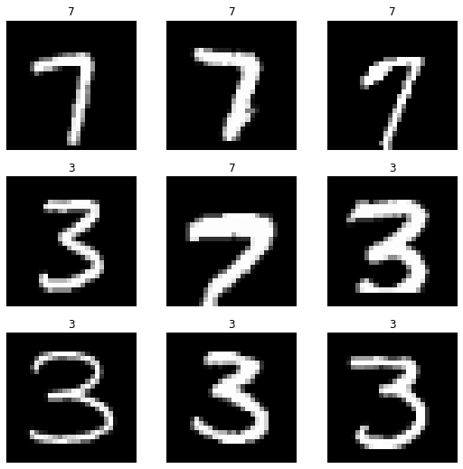
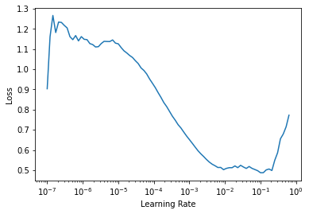

# FastAI XLA Extensions Library
> The FastAI XLA Extensions library package allows your fastai/Pytorch models to run on TPUs using the Pytorch-XLA library.


## Install

`pip install git+https://github.com/butchland/fastai_xla_extensions`

## How to use

### Configure the Pytorch XLA package 

The Pytorch xla package requires an environment supporting TPUs (Kaggle kernels, GCP or Colab environments required)

If running on Colab, make sure the Runtime Type is set to TPU.


## Install fastai

Use latest fastai and fastcore versions

```
#hide_output
#colab
![ -d /content ] && pip install -Uqq fastcore --upgrade
![ -d /content ] && pip install -Uqq fastai --upgrade
```

## Setup torch XLA


This is the official way to install Pytorch-XLA 1.7 [instructions here](https://colab.research.google.com/github/pytorch/xla/blob/master/contrib/colab/getting-started.ipynb#scrollTo=CHzziBW5AoZH)

```
#hide_output
#colab
![ -d /content ] && pip install -Uqq cloud-tpu-client==0.10 https://storage.googleapis.com/tpu-pytorch/wheels/torch_xla-1.7-cp36-cp36m-linux_x86_64.whl
```

## Check if XLA is available

### Import the libraries
Import the fastai and fastai_xla_extensions libraries

```
#colab
#hide_output
import fastai_xla_extensions.core
```

```
from fastai.vision.all import *
```

### Example
Build a MNIST classifier -- adapted from fastai course [Lesson 4 notebook](https://github.com/fastai/course-v4/blob/master/nbs/04_mnist_basics.ipynb)

Load MNIST dataset 

```
path = untar_data(URLs.MNIST_TINY)
```


Create Fastai DataBlock


_Note that batch transforms are currently
set to none as they seem to slow the training
on the TPU (for investigation)._

```
datablock = DataBlock(
    blocks=(ImageBlock,CategoryBlock),
    get_items=get_image_files,
    splitter=GrandparentSplitter(),
    get_y=parent_label,
    item_tfms=Resize(28),
    batch_tfms=[]
)
```

```
#colab
datablock.summary(path)
```

    Setting-up type transforms pipelines
    Collecting items from /root/.fastai/data/mnist_tiny
    Found 1428 items
    2 datasets of sizes 709,699
    Setting up Pipeline: PILBase.create
    Setting up Pipeline: parent_label -> Categorize -- {'vocab': None, 'sort': True, 'add_na': False}
    
    Building one sample
      Pipeline: PILBase.create
        starting from
          /root/.fastai/data/mnist_tiny/train/3/9612.png
        applying PILBase.create gives
          PILImage mode=RGB size=28x28
      Pipeline: parent_label -> Categorize -- {'vocab': None, 'sort': True, 'add_na': False}
        starting from
          /root/.fastai/data/mnist_tiny/train/3/9612.png
        applying parent_label gives
          3
        applying Categorize -- {'vocab': None, 'sort': True, 'add_na': False} gives
          TensorCategory(0)
    
    Final sample: (PILImage mode=RGB size=28x28, TensorCategory(0))
    
    
    Collecting items from /root/.fastai/data/mnist_tiny
    Found 1428 items
    2 datasets of sizes 709,699
    Setting up Pipeline: PILBase.create
    Setting up Pipeline: parent_label -> Categorize -- {'vocab': None, 'sort': True, 'add_na': False}
    Setting up after_item: Pipeline: Resize -- {'size': (28, 28), 'method': 'crop', 'pad_mode': 'reflection', 'resamples': (2, 0), 'p': 1.0} -> ToTensor
    Setting up before_batch: Pipeline: 
    Setting up after_batch: Pipeline: IntToFloatTensor -- {'div': 255.0, 'div_mask': 1}
    
    Building one batch
    Applying item_tfms to the first sample:
      Pipeline: Resize -- {'size': (28, 28), 'method': 'crop', 'pad_mode': 'reflection', 'resamples': (2, 0), 'p': 1.0} -> ToTensor
        starting from
          (PILImage mode=RGB size=28x28, TensorCategory(0))
        applying Resize -- {'size': (28, 28), 'method': 'crop', 'pad_mode': 'reflection', 'resamples': (2, 0), 'p': 1.0} gives
          (PILImage mode=RGB size=28x28, TensorCategory(0))
        applying ToTensor gives
          (TensorImage of size 3x28x28, TensorCategory(0))
    
    Adding the next 3 samples
    
    No before_batch transform to apply
    
    Collating items in a batch
    
    Applying batch_tfms to the batch built
      Pipeline: IntToFloatTensor -- {'div': 255.0, 'div_mask': 1}
        starting from
          (TensorImage of size 4x3x28x28, TensorCategory([0, 0, 0, 0]))
        applying IntToFloatTensor -- {'div': 255.0, 'div_mask': 1} gives
          (TensorImage of size 4x3x28x28, TensorCategory([0, 0, 0, 0]))


Create the dataloader

```
dls = datablock.dataloaders(path)
```

```
#colab
dls.show_batch()
```





Create a Fastai CNN Learner


```
#colab
learner = cnn_learner(dls, resnet18, metrics=accuracy)
                      
```

    Downloading: "https://download.pytorch.org/models/resnet18-5c106cde.pth" to /root/.cache/torch/hub/checkpoints/resnet18-5c106cde.pth


    


```
#colab
learner.unfreeze()
```

```
#colab
learner.summary()
```


<table border="1" class="dataframe">
  <thead>
    <tr style="text-align: left;">
      <th>epoch</th>
      <th>train_loss</th>
      <th>valid_loss</th>
      <th>accuracy</th>
      <th>time</th>
    </tr>
  </thead>
  <tbody>
    <tr>
      <td>0</td>
      <td>None</td>
      <td>None</td>
      <td>00:00</td>
    </tr>
  </tbody>
</table>


    Sequential (Input shape: ['64 x 3 x 28 x 28'])
    ================================================================
    Layer (type)         Output Shape         Param #    Trainable 
    ================================================================
    Conv2d               64 x 64 x 14 x 14    9,408      True      
    ________________________________________________________________
    BatchNorm2d          64 x 64 x 14 x 14    128        True      
    ________________________________________________________________
    ReLU                 64 x 64 x 14 x 14    0          False     
    ________________________________________________________________
    MaxPool2d            64 x 64 x 7 x 7      0          False     
    ________________________________________________________________
    Conv2d               64 x 64 x 7 x 7      36,864     True      
    ________________________________________________________________
    BatchNorm2d          64 x 64 x 7 x 7      128        True      
    ________________________________________________________________
    ReLU                 64 x 64 x 7 x 7      0          False     
    ________________________________________________________________
    Conv2d               64 x 64 x 7 x 7      36,864     True      
    ________________________________________________________________
    BatchNorm2d          64 x 64 x 7 x 7      128        True      
    ________________________________________________________________
    Conv2d               64 x 64 x 7 x 7      36,864     True      
    ________________________________________________________________
    BatchNorm2d          64 x 64 x 7 x 7      128        True      
    ________________________________________________________________
    ReLU                 64 x 64 x 7 x 7      0          False     
    ________________________________________________________________
    Conv2d               64 x 64 x 7 x 7      36,864     True      
    ________________________________________________________________
    BatchNorm2d          64 x 64 x 7 x 7      128        True      
    ________________________________________________________________
    Conv2d               64 x 128 x 4 x 4     73,728     True      
    ________________________________________________________________
    BatchNorm2d          64 x 128 x 4 x 4     256        True      
    ________________________________________________________________
    ReLU                 64 x 128 x 4 x 4     0          False     
    ________________________________________________________________
    Conv2d               64 x 128 x 4 x 4     147,456    True      
    ________________________________________________________________
    BatchNorm2d          64 x 128 x 4 x 4     256        True      
    ________________________________________________________________
    Conv2d               64 x 128 x 4 x 4     8,192      True      
    ________________________________________________________________
    BatchNorm2d          64 x 128 x 4 x 4     256        True      
    ________________________________________________________________
    Conv2d               64 x 128 x 4 x 4     147,456    True      
    ________________________________________________________________
    BatchNorm2d          64 x 128 x 4 x 4     256        True      
    ________________________________________________________________
    ReLU                 64 x 128 x 4 x 4     0          False     
    ________________________________________________________________
    Conv2d               64 x 128 x 4 x 4     147,456    True      
    ________________________________________________________________
    BatchNorm2d          64 x 128 x 4 x 4     256        True      
    ________________________________________________________________
    Conv2d               64 x 256 x 2 x 2     294,912    True      
    ________________________________________________________________
    BatchNorm2d          64 x 256 x 2 x 2     512        True      
    ________________________________________________________________
    ReLU                 64 x 256 x 2 x 2     0          False     
    ________________________________________________________________
    Conv2d               64 x 256 x 2 x 2     589,824    True      
    ________________________________________________________________
    BatchNorm2d          64 x 256 x 2 x 2     512        True      
    ________________________________________________________________
    Conv2d               64 x 256 x 2 x 2     32,768     True      
    ________________________________________________________________
    BatchNorm2d          64 x 256 x 2 x 2     512        True      
    ________________________________________________________________
    Conv2d               64 x 256 x 2 x 2     589,824    True      
    ________________________________________________________________
    BatchNorm2d          64 x 256 x 2 x 2     512        True      
    ________________________________________________________________
    ReLU                 64 x 256 x 2 x 2     0          False     
    ________________________________________________________________
    Conv2d               64 x 256 x 2 x 2     589,824    True      
    ________________________________________________________________
    BatchNorm2d          64 x 256 x 2 x 2     512        True      
    ________________________________________________________________
    Conv2d               64 x 512 x 1 x 1     1,179,648  True      
    ________________________________________________________________
    BatchNorm2d          64 x 512 x 1 x 1     1,024      True      
    ________________________________________________________________
    ReLU                 64 x 512 x 1 x 1     0          False     
    ________________________________________________________________
    Conv2d               64 x 512 x 1 x 1     2,359,296  True      
    ________________________________________________________________
    BatchNorm2d          64 x 512 x 1 x 1     1,024      True      
    ________________________________________________________________
    Conv2d               64 x 512 x 1 x 1     131,072    True      
    ________________________________________________________________
    BatchNorm2d          64 x 512 x 1 x 1     1,024      True      
    ________________________________________________________________
    Conv2d               64 x 512 x 1 x 1     2,359,296  True      
    ________________________________________________________________
    BatchNorm2d          64 x 512 x 1 x 1     1,024      True      
    ________________________________________________________________
    ReLU                 64 x 512 x 1 x 1     0          False     
    ________________________________________________________________
    Conv2d               64 x 512 x 1 x 1     2,359,296  True      
    ________________________________________________________________
    BatchNorm2d          64 x 512 x 1 x 1     1,024      True      
    ________________________________________________________________
    AdaptiveAvgPool2d    64 x 512 x 1 x 1     0          False     
    ________________________________________________________________
    AdaptiveMaxPool2d    64 x 512 x 1 x 1     0          False     
    ________________________________________________________________
    Flatten              64 x 1024            0          False     
    ________________________________________________________________
    BatchNorm1d          64 x 1024            2,048      True      
    ________________________________________________________________
    Dropout              64 x 1024            0          False     
    ________________________________________________________________
    Linear               64 x 512             524,288    True      
    ________________________________________________________________
    ReLU                 64 x 512             0          False     
    ________________________________________________________________
    BatchNorm1d          64 x 512             1,024      True      
    ________________________________________________________________
    Dropout              64 x 512             0          False     
    ________________________________________________________________
    Linear               64 x 2               1,024      True      
    ________________________________________________________________
    
    Total params: 11,704,896
    Total trainable params: 11,704,896
    Total non-trainable params: 0
    
    Optimizer used: <function Adam at 0x7f1399bb1730>
    Loss function: FlattenedLoss of CrossEntropyLoss()
    
    Callbacks:
      - TrainEvalCallback
      - XLAOptCallback
      - Recorder
      - ProgressCallback


Using the `lr_find` works 

```
#colab
learner.lr_find()
```


    SuggestedLRs(lr_min=0.010000000149011612, lr_steep=6.309573450380412e-07)





Run one cycle training.


```
#colab
learner.fit_one_cycle(5,lr_max=slice(6.3e-07,0.01))
```


<table border="1" class="dataframe">
  <thead>
    <tr style="text-align: left;">
      <th>epoch</th>
      <th>train_loss</th>
      <th>valid_loss</th>
      <th>accuracy</th>
      <th>time</th>
    </tr>
  </thead>
  <tbody>
    <tr>
      <td>0</td>
      <td>0.629290</td>
      <td>1.190237</td>
      <td>0.566524</td>
      <td>00:10</td>
    </tr>
    <tr>
      <td>1</td>
      <td>0.358590</td>
      <td>0.232812</td>
      <td>0.911302</td>
      <td>00:02</td>
    </tr>
    <tr>
      <td>2</td>
      <td>0.237743</td>
      <td>0.130314</td>
      <td>0.971388</td>
      <td>00:02</td>
    </tr>
    <tr>
      <td>3</td>
      <td>0.169761</td>
      <td>0.126199</td>
      <td>0.969957</td>
      <td>00:02</td>
    </tr>
    <tr>
      <td>4</td>
      <td>0.122370</td>
      <td>0.111455</td>
      <td>0.971388</td>
      <td>00:02</td>
    </tr>
  </tbody>
</table>


Further fine-tuning

```
#colab
learner.fit_one_cycle(5,slice(7e-4, 1e-3))
```


<table border="1" class="dataframe">
  <thead>
    <tr style="text-align: left;">
      <th>epoch</th>
      <th>train_loss</th>
      <th>valid_loss</th>
      <th>accuracy</th>
      <th>time</th>
    </tr>
  </thead>
  <tbody>
    <tr>
      <td>0</td>
      <td>0.005863</td>
      <td>0.070885</td>
      <td>0.984263</td>
      <td>00:02</td>
    </tr>
    <tr>
      <td>1</td>
      <td>0.038074</td>
      <td>0.360497</td>
      <td>0.948498</td>
      <td>00:02</td>
    </tr>
    <tr>
      <td>2</td>
      <td>0.109056</td>
      <td>0.150170</td>
      <td>0.979971</td>
      <td>00:02</td>
    </tr>
    <tr>
      <td>3</td>
      <td>0.114290</td>
      <td>0.122179</td>
      <td>0.984263</td>
      <td>00:02</td>
    </tr>
    <tr>
      <td>4</td>
      <td>0.087704</td>
      <td>0.071846</td>
      <td>0.989986</td>
      <td>00:02</td>
    </tr>
  </tbody>
</table>


Model params are using TPU

```
#colab
one_param(learner.model).device
```


    device(type='xla', index=1)


Plot loss seems to be working fine.

```
#colab
learner.recorder.plot_loss()
```


## Samples

Other examples of fastai notebooks using the fastai_xla_extensions package are also available here: 

* [Vision](https://github.com/butchland/fastai_xla_extensions/blob/master/samples/MNIST_TPU_demo.ipynb) [](https://colab.research.google.com/github/butchland/fastai_xla_extensions/blob/master/samples/MNIST_TPU_demo.ipynb)

* [Collaborative Filtering](https://github.com/butchland/fastai_xla_extensions/blob/master/samples/MovieLensCollaborativeFilteringTPU.ipynb) [](https://colab.research.google.com/github/butchland/fastai_xla_extensions/blob/master/samples/MovieLensCollaborativeFilteringTPU.ipynb)

* [Tabular](https://github.com/butchland/fastai_xla_extensions/blob/master/samples/TabularTrainingTPUdemo.ipynb) [](https://colab.research.google.com/github/butchland/fastai_xla_extensions/blob/master/samples/TabularTrainingTPUdemo.ipynb)

More samples will be added in the future as we fix issues and implement more capabilities.


## Status
The fastai XLA extensions library is still in very early development phase (not even alpha) which means there's still a lot of things not working. 

Use it at your own risk.

If you wish to contribute to the project, fork it and make pull request. 

This project uses [nbdev](https://nbdev.fast.ai/) -- a jupyter notebook first development environment and is being developed on [Colab](https://colab.research.google.com).

