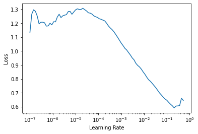
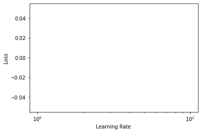

# FastAI XLA Extensions Library
> The FastAI XLA Extensions library package allows your fastai/Pytorch models to run on TPUs using the Pytorch-XLA library.


## Install

`pip install git+https://github.com/butchland/fastai_xla_extensions`

## How to use

### Configure the Pytorch XLA package 

The Pytorch xla package requires an environment supporting TPUs (Kaggle kernels, GCP or Colab environments required)

If running on Colab, make sure the Runtime Type is set to TPU.


```
#hide_input
#colab
import os
assert os.environ['COLAB_TPU_ADDR'], 'Make sure to select TPU from Edit > Notebook settings > Hardware accelerator'
```

```
#hide_output
#colab
VERSION = "20200325"  #@param ["1.5" , "20200325", "nightly"]
!curl https://raw.githubusercontent.com/pytorch/xla/master/contrib/scripts/env-setup.py -o pytorch-xla-env-setup.py
!python pytorch-xla-env-setup.py --version $VERSION
```

Install fastai2 and the fastai_xla_extensions packages

```
#hide_output
#colab
!pip install fastai2 --upgrade > /dev/null
```

```
#hide_output
#ci
!pip install git+https://github.com/butchland/fastai_xla_extensions > /dev/null
```

### Import the libraries
Import the fastai2 and fastai_xla_extensions libraries

```
#colab
import fastai_xla_extensions.core
```

**IMPORTANT: Make sure to import fastai_xla_extensions.core BEFORE importing fastai2 libraries** 

If you don't, fastai2 will not default to use tpu device but will instead use the cpu.

```
from fastai2.vision.all import *
```

### Example
Build a MNIST classifier -- adapted from fastai course [Lesson 4 notebook](https://github.com/fastai/course-v4/blob/master/nbs/04_mnist_basics.ipynb)

Load MNIST dataset 

```
path = untar_data(URLs.MNIST_TINY)
```


Create Fastai DataBlock


_Note that batch transforms are currently
set to none as they seem to slow the training
on the TPU (for investigation)._

```
datablock = DataBlock(
    blocks=(ImageBlock,CategoryBlock),
    get_items=get_image_files,
    splitter=GrandparentSplitter(),
    get_y=parent_label,
    item_tfms=Resize(28),
    batch_tfms=[]
)
```

```
#colab
datablock.summary(path)
```

    Setting-up type transforms pipelines
    Collecting items from /root/.fastai/data/mnist_tiny
    Found 1428 items
    2 datasets of sizes 709,699
    Setting up Pipeline: PILBase.create
    Setting up Pipeline: parent_label -> Categorize
    
    Building one sample
      Pipeline: PILBase.create
        starting from
          /root/.fastai/data/mnist_tiny/train/7/8361.png
        applying PILBase.create gives
          PILImage mode=RGB size=28x28
      Pipeline: parent_label -> Categorize
        starting from
          /root/.fastai/data/mnist_tiny/train/7/8361.png
        applying parent_label gives
          7
        applying Categorize gives
          TensorCategory(1)
    
    Final sample: (PILImage mode=RGB size=28x28, TensorCategory(1))
    
    
    Setting up after_item: Pipeline: Resize -> ToTensor
    Setting up before_batch: Pipeline: 
    Setting up after_batch: Pipeline: IntToFloatTensor
    
    Building one batch
    Applying item_tfms to the first sample:
      Pipeline: Resize -> ToTensor
        starting from
          (PILImage mode=RGB size=28x28, TensorCategory(1))
        applying Resize gives
          (PILImage mode=RGB size=28x28, TensorCategory(1))
        applying ToTensor gives
          (TensorImage of size 3x28x28, TensorCategory(1))
    
    Adding the next 3 samples
    
    No before_batch transform to apply
    
    Collating items in a batch
    
    Applying batch_tfms to the batch built
      Pipeline: IntToFloatTensor
        starting from
          (TensorImage of size 4x3x28x28, TensorCategory([1, 1, 1, 1], device='xla:1'))
        applying IntToFloatTensor gives
          (TensorImage of size 4x3x28x28, TensorCategory([1, 1, 1, 1], device='xla:1'))


Create the dataloader

```
dls = datablock.dataloaders(path)
```

```
#colab
dls.device
```


    device(type='xla', index=1)


```
#colab
dls.show_batch()
```


Create a Fastai CNN Learner

```
#colab
learner = cnn_learner(dls, resnet18, metrics=accuracy)
                      
```

    Downloading: "https://download.pytorch.org/models/resnet18-5c106cde.pth" to /root/.cache/torch/checkpoints/resnet18-5c106cde.pth


    


Using the `lr_find` works 

```
#colab
learner.lr_find()
```


    SuggestedLRs(lr_min=0.02089296132326126, lr_steep=0.00363078061491251)





Fine tune model


```
#colab
learner.fine_tune(1, base_lr=1e-2)
```


<table border="1" class="dataframe">
  <thead>
    <tr style="text-align: left;">
      <th>epoch</th>
      <th>train_loss</th>
      <th>valid_loss</th>
      <th>accuracy</th>
      <th>time</th>
    </tr>
  </thead>
  <tbody>
    <tr>
      <td>0</td>
      <td>0.700084</td>
      <td>0.354779</td>
      <td>0.858369</td>
      <td>00:13</td>
    </tr>
  </tbody>
</table>


<table border="1" class="dataframe">
  <thead>
    <tr style="text-align: left;">
      <th>epoch</th>
      <th>train_loss</th>
      <th>valid_loss</th>
      <th>accuracy</th>
      <th>time</th>
    </tr>
  </thead>
  <tbody>
    <tr>
      <td>0</td>
      <td>0.420915</td>
      <td>0.154074</td>
      <td>0.939914</td>
      <td>00:10</td>
    </tr>
  </tbody>
</table>


Unfreeze the model

```
#colab
learner.unfreeze()
```

Run the LR Finder again. 

_(Something wrong with the results. Still need to debug this.)_

```
#colab
learner.lr_find()
```





Further fine-tuning

```
#colab
learner.fit_one_cycle(1,slice(7e-4),pct_start=0.99)
```


<table border="1" class="dataframe">
  <thead>
    <tr style="text-align: left;">
      <th>epoch</th>
      <th>train_loss</th>
      <th>valid_loss</th>
      <th>accuracy</th>
      <th>time</th>
    </tr>
  </thead>
  <tbody>
    <tr>
      <td>0</td>
      <td>0.225033</td>
      <td>0.138237</td>
      <td>0.961373</td>
      <td>00:07</td>
    </tr>
  </tbody>
</table>


Model params are using TPU

```
#colab
list(learner.model.parameters())[0].device
```


    device(type='xla', index=1)


```
#colab
learner.unfreeze()
```

```
#colab
learner.fit_one_cycle(4,lr_max=slice(1e-6,1e-4))
```


<table border="1" class="dataframe">
  <thead>
    <tr style="text-align: left;">
      <th>epoch</th>
      <th>train_loss</th>
      <th>valid_loss</th>
      <th>accuracy</th>
      <th>time</th>
    </tr>
  </thead>
  <tbody>
    <tr>
      <td>0</td>
      <td>0.120318</td>
      <td>0.147932</td>
      <td>0.962804</td>
      <td>00:06</td>
    </tr>
    <tr>
      <td>1</td>
      <td>0.118728</td>
      <td>0.162152</td>
      <td>0.967096</td>
      <td>00:02</td>
    </tr>
    <tr>
      <td>2</td>
      <td>0.086982</td>
      <td>0.164669</td>
      <td>0.967096</td>
      <td>00:02</td>
    </tr>
    <tr>
      <td>3</td>
      <td>0.090189</td>
      <td>0.191845</td>
      <td>0.965665</td>
      <td>00:02</td>
    </tr>
  </tbody>
</table>


```
#colab
learner.fit_one_cycle(4,lr_max=slice(4e-6,5e-4))
```


<table border="1" class="dataframe">
  <thead>
    <tr style="text-align: left;">
      <th>epoch</th>
      <th>train_loss</th>
      <th>valid_loss</th>
      <th>accuracy</th>
      <th>time</th>
    </tr>
  </thead>
  <tbody>
    <tr>
      <td>0</td>
      <td>0.052742</td>
      <td>0.192184</td>
      <td>0.965665</td>
      <td>00:02</td>
    </tr>
    <tr>
      <td>1</td>
      <td>0.043489</td>
      <td>0.170410</td>
      <td>0.965665</td>
      <td>00:02</td>
    </tr>
    <tr>
      <td>2</td>
      <td>0.047202</td>
      <td>0.157111</td>
      <td>0.968526</td>
      <td>00:02</td>
    </tr>
    <tr>
      <td>3</td>
      <td>0.033719</td>
      <td>0.147349</td>
      <td>0.968526</td>
      <td>00:02</td>
    </tr>
  </tbody>
</table>


Plot loss seems to be working fine.

```
#colab
learner.recorder.plot_loss()
```


## Status
The fastai XLA extensions library is still in very early development phase (not even alpha) which means there's still a lot of things not working. 

Use it at your own risk.

If you wish to contribute to the project, fork it and make pull request. 

This project uses [nbdev](https://nbdev.fast.ai/) -- a jupyter notebook first development environment and is being developed on [Colab](https://colab.research.google.com).

